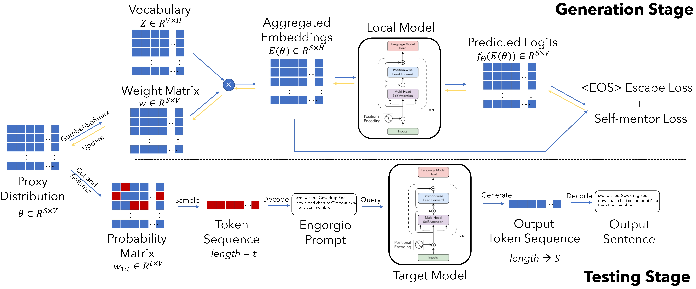

<a name="readme-top"></a>

# An Engorgio Prompt Makes Large Language Model Babble on

*This is the code repository for our paper: [An Engorgio Prompt Makes Large Language Model Babble on](https://arxiv.org/abs/2412.19394)*

## Overview

This repository provides tools and code for:

1. Crafting and testing Engorgio prompts
2. Experimenting with different optimization/design configurations
3. Evaluating average length and rate metrics for specific prompts

**Citation:** If you find our project useful, please consider citing: 🤗🤗🤗
```bibtex
@inproceedings{dong2025engorgio,
    title={An Engorgio Prompt Makes Large Language Model Babble on},
    author={Jianshuo Dong and Ziyuan Zhang and Qingjie Zhang and Han Qiu and Tianwei Zhang and Hao Wang and Hewu Li and Qi Li and Chao Zhang and Ke Xu},
    booktitle={The Thirteenth International Conference on Learning Representations},
    year={2025},
    url={https://openreview.net/forum?id=m4eXBo0VNc}
}
```

## Abstract


Auto-regressive large language models (LLMs) have yielded impressive performance in many real-world tasks. 
However, the new paradigm of these LLMs also exposes novel threats. 
In this paper, we explore their vulnerability to inference cost attacks, where a malicious user crafts Engorgio prompts to intentionally increase the computation cost and latency of the inference process. We design Engorgio, a novel methodology, to efficiently generate adversarial Engorgio prompts to affect the target LLM's service availability. Engorgio has the following two technical contributions. 
(1) We employ a parameterized distribution to track LLMs' prediction trajectory. (2) Targeting the auto-regressive nature of LLMs' inference process, we propose novel loss functions to stably suppress the appearance of the \<EOS\> token, whose occurrence will interrupt the LLM's generation process. 
We conduct extensive experiments on 13 open-sourced LLMs with parameters ranging from 125M to 30B. 
The results show that Engorgio prompts can successfully induce LLMs to generate abnormally long outputs (i.e., roughly 2-13X longer to reach 90\%+ of the output length limit)
in a white-box scenario and our real-world experiment demonstrates Engergio's threat to LLM service with limited computing resources.



<p align="right">(<a href="#readme-top">back to top</a>)</p>


## Getting Started

### Prerequisites

The project requires anaconda/miniconda. Set up your environment using:

```bash
conda env create -f environment.yml
```

### Model Checkpoints

You can obtain model checkpoints in two ways:

1. **Automatic Download**: The Python script supports automatic downloading of selected models from the Hugging Face Hub.

2. **Manual Download**: Download checkpoints manually and configure the paths in `ica_utils/model.py`:
   ```python
   AutoTokenizer.from_pretrained('/PATH/TO/THE/FILES')
   AutoModel.from_pretrained('/PATH/TO/THE/FILES')
   ```


<p align="right">(<a href="#readme-top">back to top</a>)</p>


## Usage

### Quick Start

Run the script on your local server:

```bash
CUDA_VISIBLE_DEVICES=0 python ./ica_code.py \
    --model gpt2 \
    --log_interval 200 \
    --num_iters 3000 \
    --opt_alpha 1 \
    --loss_opt 1 2 \
    --esc_loss_version 0 \
    --trigger_token_length 32 \
    --max_length 2048 \
    --initial_coeff 0 \
    --bs 8 \
    --sample_time 80 \
    --load_in_8bit \
    --seed 123
```

### Configuration Parameters

| Parameter | Description |
|-----------|-------------|
| `model` | Target model in white-box scenarios |
| `lr` | Learning rate for optimization |
| `num_iters` | Number of optimization iterations without checker |
| `opt_alpha` | λ coefficient for optimization problem |
| `loss_opt` | Loss terms selection (1: self-mentor, 2: EOS escape, 1 2: both) |
| `esc_loss_version` | EOS escape loss configuration (0: with trigger, 1: without) |
| `trigger_token_length` | Length of trigger sequence |
| `max_length` | Maximum length for generation process |
| `initial_coeff` | Random initialization of distribution matrix coefficient |
| `bs` | Batch size for inference (recommended: 8 for 7B models on single A100) |
| `sample_time` | Number of generation iterations for metrics calculation |
| `load_in_8bit` | Enable int8 quantization for large models |


<p align="right">(<a href="#readme-top">back to top</a>)</p>
